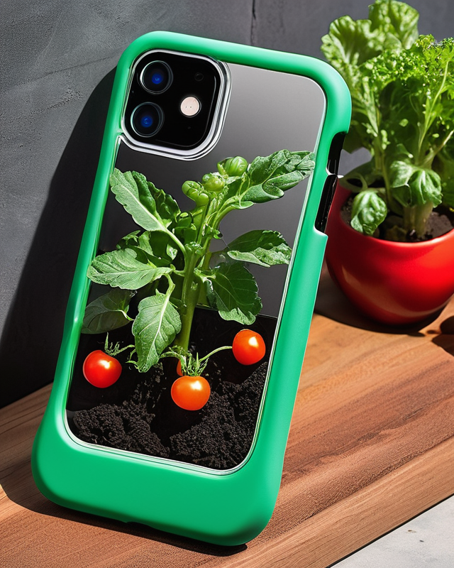

# PlantCase - A Phone Case With a Pocket Garden
## Introduction
Introducing the PlantCase - a phone case like you've never seen before. We've integrated a self-contained gardening system directly into a slim, protective phone covering so you'll never have to choose between nurturing your plants and staying connected on your mobile device!

The built-in 1 inch planter has capacity for shallow-rooted greens that can thrive under phone-generated LED light. Simply secure your phone into the sleek case, select your virtual “seed” in our Plant ParenthoodTM app, provide water through the self-water system and watch your mini urban garden sprout!

With versatile mounting options, the PlantCase can be propped at different angles to optimize lighting for your tiny leafy inhabitants. The sealed growing compartment also prevents any soil leakage while still allowing visibility of your micro sprouts.

Offering a playful, convenient way to cultivate plants anywhere, the PlantCase makes on-the-go gardening possible right from your pocket. Our patent-pending design places your produce safely outside electronic components, avoiding device damage.

Bring some living green into your daily technology routine! Back the PlantCase on Kickstarter today and you’ll be first in line when these pocket planters are ready to ship. Let’s fuse mobile home gardens with portable tech in an innovative, eco-friendly package!

## Why Back Us? ✔️
Convenient urban gardening anywhere
Promotes sustainability & eco-consciousness
Educational and fun!
iPhone & Android models available

## Key Features 📱+🌱
Self-contained 1" planter
Custom self-watering irrigation
Strategic drainage holes and waterproof seals
Directs phone’s LED light for plant growth

## Rewards 🎁
-🌿 Seedling - Good karma for $5 pledge
-🌱 Sprout - Sticker pack for $25 pledge
-🌳 Tree - PlantCase + app access for $75 pledge

## Meet The Team 👋
Horticulture experts, engineers, and app developers passionate about this project! View photos and bios below.

## Production Plan 🛠
With funding we can manufacture using sustainable methods and materials right here in our home state! View production roadmap.

Made by the brilliant minds of susanna3003 and Claude.

